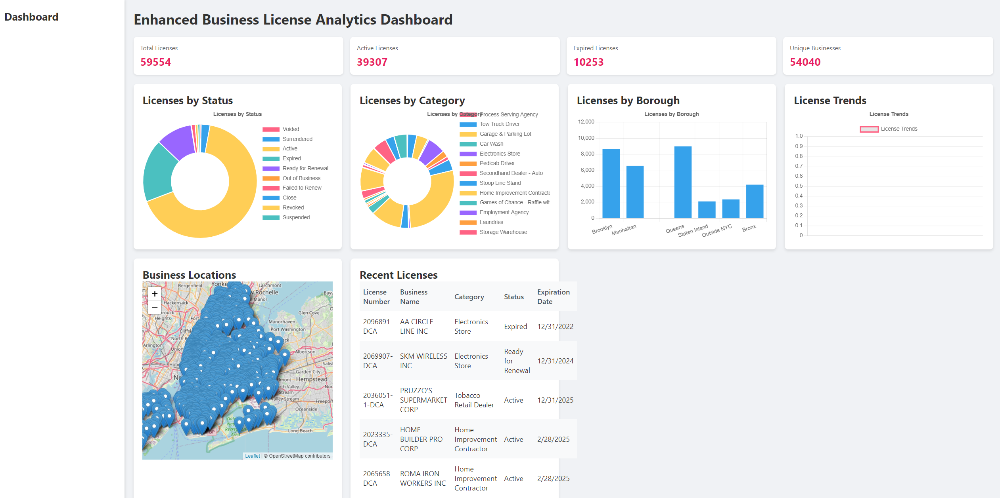
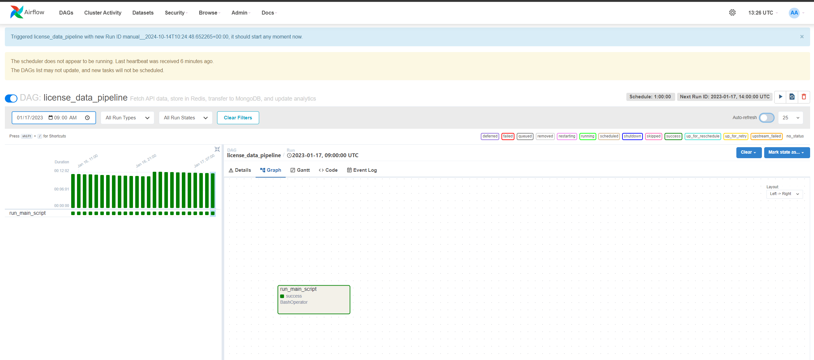

# Distributed Data Pipeline and Analytics System
## Introduction
This project is a distributed data pipeline and analytics system that is designed to process 
and analyze large amounts of data. The system is built using Apache Kafka, Apache Spark, and Apache Cassandra. 
The system is designed to be scalable and fault-tolerant, and can be used to process data from a variety of sources.
### Data ingestion
The system is designed to ingest data from a variety of sources, including files, databases, and APIs.
We will be using NYC business license data as an example dataset for this project.
file: [nyc_async.py](configs/nyc_async.py)
#### File details nyc_async.py
```python
async def fetch_data(session: aiohttp.ClientSession, url: str, ) -> str:
    """ Fetch Data From URL """
    try:
        async with session.get(url) as response:
            response.raise_for_status()
            return await response.text()
    except aiohttp.ClientError as e:
        print(f"Error fetching data from {url}: {e}")
        return []


async def get_total_count(session: aiohttp.ClientSession) -> int:
    """ Get Total Count of Records """
    url = f"{BASE_URL}?$select=count(*)"

    try:
        async with session.get(url) as response:
            response.raise_for_status()
            data = await response.json()
            return int(data[0]['count'])
    except (aiohttp.ClientError, KeyError, IndexError, ValueError) as e:
        print(f"Error fetching data from {url}: {e}")
        return MAX_ITEMS


async def fetch_data_from_api():

    async with aiohttp.ClientSession() as session:
        total_count = min(await get_total_count(session), MAX_ITEMS)
        urls = [f"{BASE_URL}?$limit={ROWS_PER_REQUEST}&$offset={offset}" for offset in
                range(0, total_count, ROWS_PER_REQUEST)]

        tasks = [fetch_data(session, url) for url in urls]
        responses = await asyncio.gather(*tasks)

        all_data = [item for sublist in responses for item in json.loads(sublist)]

        # print length of dataset
        print(f"Total records retrieved {sum([len(response) for response in responses])}")

        if all_data:
            print(len(all_data))

        return all_data
```

The following functions were used to handle the fetching of data from the NYC Open Data API.
utilizing the aiohttp library to make asynchronous requests to the API.
This made it possible to fetch data from the API in parallel, which helped to speed up the data ingestion process.
```python
import asyncio
```
### Caching and temporary Storage
The system uses Redis as a caching layer to store temporary data.
file: [redis_server.py](configs/redis_server.py)
```python
async def start_redis(local_host: str, port: int, dbms: int) -> aioredis.Redis:
    """ Start Redis Server """
    try:
        r = await aioredis.from_url(f"redis://{local_host}:{port}/{dbms}")
        return r
    except aioredis.RedisError as e:
        print(f"Error connecting to Redis Server: {e}")
        return None


async def fetch_data(redis_server: aioredis.Redis, key: str) -> dict:
    """ Fetch Data from Redis """
    all_data = {}
    cursor = '0'

    try:
        while cursor != 0:
            cursor, keys = await redis_server.scan(cursor, count = 1000)


            keys = [key.decode('utf-8') if isinstance(key, bytes) else key for key in keys]

            values = await asyncio.gather(*[redis_server.get(key) for key in keys])

            for key, value in zip(keys, values):
                all_data[key] = json.loads(value) if value else None

        return all_data

    except aioredis.exceptions.ConnectionError as e:
        print(f"Error fetching data from Redis Server: {e}")
        return None

async def get_or_cache_data(redis_server: aioredis.Redis):
    cached_data_key = 'api_cached_key'
    cached = await redis_server.get(cached_data_key)
    # checked if there is data cached
    if cached:
        print("Fetching data from cache......")
        data = json.loads(cached)
        if not data:
            print("Cached data empty")
            await redis_server.delete(cached_data_key)
        else:
            return data


    data = await nyc_async.run_async()
    pipeline = redis_server.pipeline()

    for index, value in enumerate(data):
        key = f"{value['license_nbr']}"
        pipeline.set(key, json.dumps(value))

    await pipeline.execute()

    await redis_server.set(cached_data_key, json.dumps(data), ex=3600)

    return data
```
Some of the functionality of this code was to:
- Fetch data and save it to the redis server
- Transfer data from the redis server into a proper format for mongodb
- cache the data for a period of time


### Storage in MongoDB
The system uses MongoDB as a database to store the processed data.
file: [mongo_server.py](configs/mongo_db.py)
```python
def start_mongo(local_host: str, port: int) -> MongoClient:
    """ Start MongoDB Server """
    try:
        client = MongoClient(local_host, port)
        return client
    except Exception as e:
        print(f"Error connecting to MongoDB Server: {e}")
        return None


def insert_data(client: MongoClient, db_name: str, collection_name: str, data: dict) -> bool:
    """ Insert Data into MongoDB """
    try:
        db = client[db_name]
        collection = db[collection_name]
        print("Inserting data")
        for value in data:
            record = collection.find_one({'license_nbr': value['license_nbr']})
            if not record:
                collection.insert_one(value)
        return True
    except Exception as e:
        print(f"Error inserting data into MongoDB: {e}")
        return False


def create_index(client: MongoClient, db_name: str, collection_name: str, column_name: str):
    database = client[db_name]
    collection_name = database[collection_name]
    indexes = collection_name.index_information()

    if f"{column_name}_1" in indexes:
        print(f"Index on '{column_name}' already exists.")
    else:
        # Create a unique index on the specified column
        collection_name.create_index([(column_name, pymongo.ASCENDING)], unique=True)
        print(f"Unique index created on '{column_name}'")
    # check if index created
    print(collection_name.list_indexes())


def fetch_all_data(client: MongoClient, db_name: str, collection_name: str):
    database = client[db_name]
    collection_name = database[collection_name]

    data = collection_name.find({})
    return (data)


def serialize_doc(doc):
    """Convert MongoDB document to JSON serializable format."""
    if isinstance(doc, dict):
        for key, value in doc.items():
            if isinstance(value, ObjectId):
                doc[key] = str(value)
            elif isinstance(value, (dict, list)):
                doc[key] = serialize_doc(value)
    elif isinstance(doc, list):
        return [serialize_doc(item) for item in doc]
    return doc
```
Some of the functionality of this code was to:
- Insert data into MongoDB function
- Create a unique index on a specified column: 
- Fetch all data from MongoDB
- Convert MongoDB document to JSON serializable format
- Check if an index exists on a specified column

Now we look at what each function does
- start_mongo(): This function connects to the MongoDB server and returns a MongoClient object.
- insert_data(): This function inserts data into a specified collection in the MongoDB database.
- create_index(): This function creates a unique index on a specified column in a collection.
- fetch_all_data(): This function fetches all data from a specified collection in the MongoDB database.
- serialize_doc(): This function converts a MongoDB document to a JSON serializable format.

### Analytics and Data Insights
This function was used to generate insights from the data stored in MongoDB.
file: [analytics.py](analytics.py)
```python
@app.route('/api/analytics', methods=['GET'])
def get_analytics():
    try:
        total_licenses = collection.count_documents({})
        active_licenses = collection.count_documents({'license_status': 'Active'})
        expired_licenses = collection.count_documents({'license_status': 'Expired'})
        unique_businesses = collection.distinct('business_unique_id')

        analytics = {
            'total_licenses': total_licenses,
            'active_licenses': active_licenses,
            'expired_licenses': expired_licenses,
            'unique_businesses': len(unique_businesses)
        }

        return jsonify(analytics)
    except Exception as e:
        return jsonify({"error": f"Error calculating analytics: {str(e)}"}), 500


@app.route('/api/licenses/by-status', methods=['GET'])
def licenses_by_status():
    try:
        pipeline = [
            {"$group": {"_id": "$license_status", "count": {"$sum": 1}}}
        ]
        result = list(collection.aggregate(pipeline))
        return jsonify(result)
    except Exception as e:
        return jsonify({"error": f"Error retrieving licenses by status: {str(e)}"}), 500


@app.route('/api/licenses/by-category', methods=['GET'])
def licenses_by_category():
    try:
        pipeline = [
            {"$group": {"_id": "$business_category", "count": {"$sum": 1}}}
        ]
        result = list(collection.aggregate(pipeline))
        return jsonify(result)
    except Exception as e:
        return jsonify({"error": f"Error retrieving licenses by category: {str(e)}"}), 500


@app.route('/api/licenses/by-borough', methods=['GET'])
def licenses_by_borough():
    try:
        pipeline = [
            {"$group": {"_id": "$address_borough", "count": {"$sum": 1}}}
        ]
        result = list(collection.aggregate(pipeline))
        return jsonify(result)
    except Exception as e:
        return jsonify({"error": f"Error retrieving licenses by borough: {str(e)}"}), 500


@app.route('/api/licenses/trend', methods=['GET'])
def license_trend():
    try:
        # Get the start date (30 days ago)
        start_date = datetime.now() - timedelta(days=30)

        pipeline = [
            {"$match": {"license_creation_date": {"$gte": start_date}}},
            {"$group": {
                "_id": {"$dateToString": {"format": "%Y-%m-%d", "date": "$license_creation_date"}},
                "count": {"$sum": 1}
            }},
            {"$sort": {"_id": 1}}
        ]
        result = list(collection.aggregate(pipeline))

        # Convert the result to the format expected by the frontend
        trend_data = [{"date": item["_id"], "count": item["count"]} for item in result]
        return jsonify(trend_data)
    except Exception as e:
        return jsonify({"error": f"Error retrieving license trend: {str(e)}"}), 500


@app.route('/api/licenses/locations', methods=['GET'])
def license_locations():
    try:
        # Limit to 1000 locations to prevent overloading the map
        locations = list(collection.find(
            {"latitude": {"$exists": True}, "longitude": {"$exists": True}},
            {"business_name": 1, "license_nbr": 1, "latitude": 1, "longitude": 1}
        ).limit(1000))

        # Clean the ObjectIds to be strings for JSON serialization
        locations = [clean_json(location) for location in locations]
        return jsonify(locations)
    except Exception as e:
        return jsonify({"error": f"Error retrieving license locations: {str(e)}"}), 500


def clean_json(data):
    if isinstance(data, list):
        for item in data:
            item['_id'] = str(item['_id'])
    elif isinstance(data, dict):
        if '_id' in data:
            data['_id'] = str(data['_id'])
    return data


@app.route('/api/licenses', methods=['GET'])
def get_licenses():
    try:
        page = int(request.args.get('page', 1))
        per_page = int(request.args.get('per_page', 10))
        skip = (page - 1) * per_page

        licenses = list(collection.find({}).skip(skip).limit(per_page))

        # Clean the ObjectIds to be strings for JSON serialization
        licenses = [clean_json(license) for license in licenses]

        return jsonify(licenses)
    except Exception as e:
        return jsonify({"error": f"Error retrieving licenses: {str(e)}"}), 500
```
We will now look at each function and what it does
- get_analytics(): This function calculates the total number of licenses, active licenses, expired licenses, and unique businesses in the dataset.
- licenses_by_status(): This function groups the licenses by status (Active, Expired, etc.) and returns the count of licenses in each category.
- licenses_by_category(): This function groups the licenses by business category and returns the count of licenses in each category.
- licenses_by_borough(): This function groups the licenses by borough and returns the count of licenses in each borough.
- license_trend(): This function calculates the trend of license creation over the past 30 days and returns the count of licenses created each day.
- license_locations(): This function retrieves the locations of the licenses that have latitude and longitude coordinates and returns the business name, license number, latitude, and longitude of each location.
- get_licenses(): This function retrieves a paginated list of licenses from the dataset.
- clean_json(): This function converts the ObjectIds in the data to strings for JSON serialization.
- The functions use MongoDB's aggregation framework to perform complex queries on the dataset and return the results in a JSON format.
- The results are then returned as JSON responses to the frontend application.
- Flask was used to create a RESTful API that exposes the analytics endpoints to the frontend application.
### Frontend Application
The frontend was done using htnl and css and the following functions were used to interact with the backend
file: [dashboard.html](templates/dashboard.html)


### Workflow orchestration
The work flow orchestration was done using airflow and the following functions were used to orchestrate the workflow
file: [data_pipeline.py](dags/data_pipeline.py)
```python
default_args = {
    'owner': 'airflow',
    'depends_on_past': False,
    'start_date': datetime(2023, 1, 1),
    'email_on_failure': False,
    'email_on_retry': False,
    'retries': 1,
    'retry_delay': timedelta(minutes=5),
}

dag = DAG(
    'license_data_pipeline',
    default_args=default_args,
    description='Fetch API data, store in Redis, transfer to MongoDB, and update analytics',
    schedule_interval=timedelta(hours=1),  # Run every hour
)

# The directory where the DAG file is located
dag_directory = os.path.dirname(os.path.abspath(__file__))

with dag:
    run_main_script = BashOperator(
        task_id='run_main_script',
        bash_command=f'cd {dag_directory} && ./main.py',
    )

    run_main_script
```
The following functions were used to orchestrate the workflow:
- default_args: This dictionary contains the default arguments for the DAG, such as the owner, start date, and retry settings.
- dag: This creates a new DAG object with the specified name, default arguments, description, and schedule interval.
- run_main_script: This BashOperator task runs the main.py script, which fetches data from the API, stores it in Redis, transfers it to MongoDB, and updates the analytics.
- The dag_directory variable stores the directory where the DAG file is located.
- The run_main_script task is added to the DAG using the with dag: context manager.


### Conclusion
This project demonstrates how to build a distributed data pipeline and analytics system using Redis, MongoDB, Flask, and Airflow. The system is designed to be scalable and fault-tolerant, and can be used to process and analyze large amounts of data from a variety of sources. The system ingests data from an API, caches it in Redis, stores it in MongoDB, and generates analytics insights. The frontend application interacts with the backend API to display the analytics insights to the user. The workflow orchestration is done using Airflow, which schedules and runs the data pipeline at regular intervals. This project provides a blueprint for building a distributed data pipeline and analytics system that can be customized and extended to meet specific requirements.
```